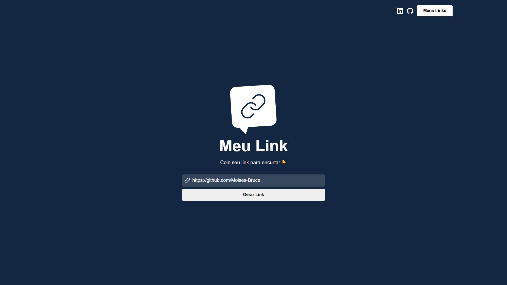
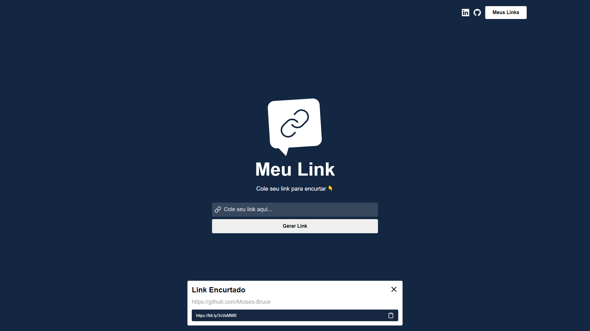
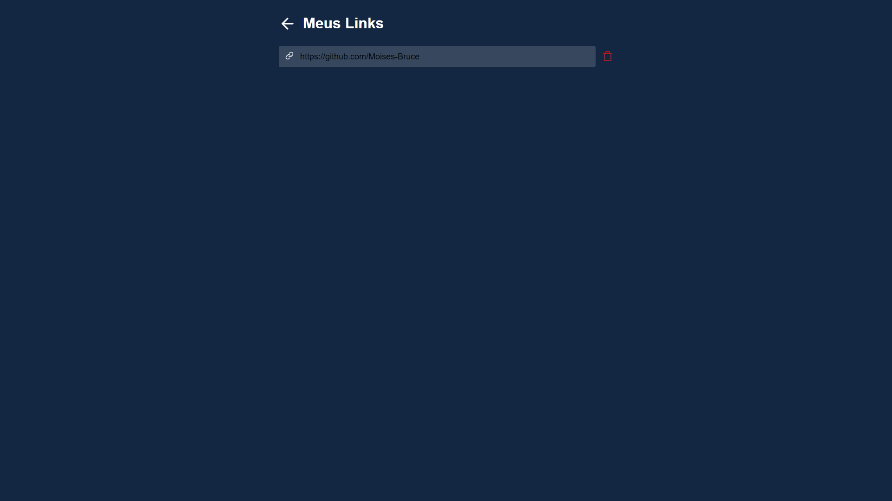
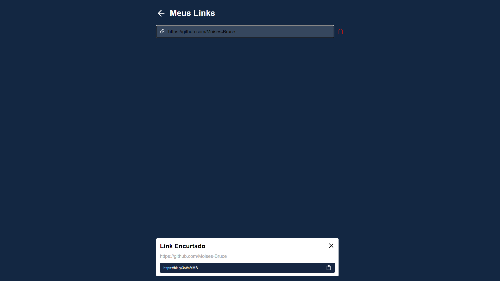

<div align="center">
  <div align="center">
    
  </div>

  <h3>My Link</h3>

  <h4>Encurtador de Links 🔗<h4/>
</div>
  
  <br>

## 🧪 Tecnologias:

- [React](https://reactjs.org)
- Api bitly
## 🚀 Como executar

- Clone o projeto
- Acesse a pasta do projeto

```bash
$ git clone https://github.com/Moises-Bruce/ReactJS-MyLink.git
$ cd ReactJS-MyLink
```
  
*🔰 Observação: É necessário uma conta na plataforma https://bitly.com/ para garantir seu token de acesso que irá permitir encurtar os links*
  
Após isso basta seguir os passos abaixo para executar o projeto:
```bash
# Instalar as dependências
$ yarn
# Iniciar o projeto
$ yarn start
```
  
## 💻 Projeto

O MyLink é uma aplicação feita para encurtar links grandes, tornando-o mais atrativo 

<p align="center">
  
  
  
  
</p>
